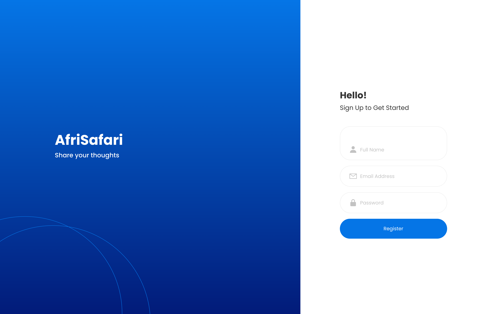
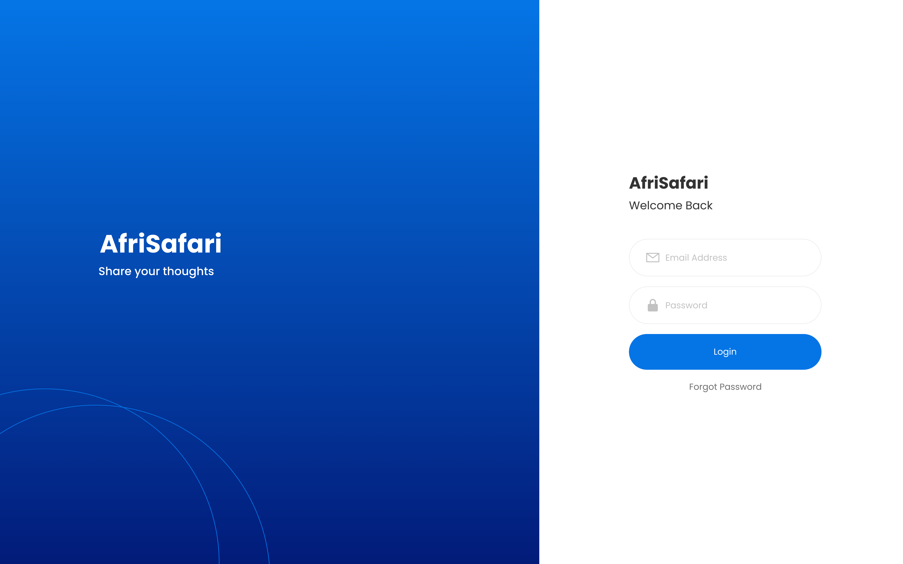
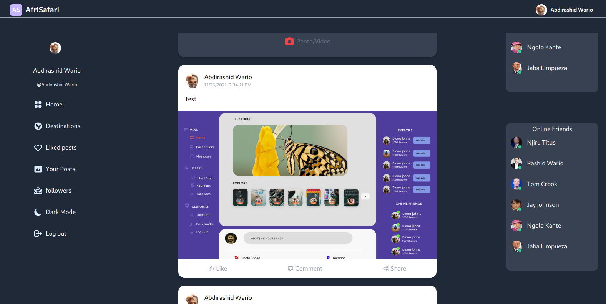

# TOURS & TRAVEL WEBSITE

A RESPONSIVE TRAVEL AND TOURS WEBSITE WHERE TOURISTS CAN SHARE THEIR PLEASURABLE EXPERIENCES

## Table of Contents

- [Table of Contents](#table-of-contents)
- [Problem Statement](#problem-statement)
- [Objectives](#objectives)
- [Users](#users)
- [Technologies](#technologies)
- [Contributing Guide](#contributing-guide)
- [REQUIREMENTS SPECIFICATION](#requirements-specification)

  - [Technical Requirements](#technical-requirements)
  - [Non-functional requirements](#non-functional-requirements)
  - [Functional Requirements](#functional-requirements)

- [Software Design Description](#software-design-description)
  - [User Interface Design](#user-interface-design)
    - [Dashboard](#dashboard)
    - [Login Page](#login-page)
    - [Registration Page](#registration-page)

## Problem Statement

Owing to the fact that many people have started embracing safaris we lack a platform where they can share their experiences with others who might be into travel and safaris. Other social media are not customized for specific postings hence not specific for safari and travel experiences.Kenya is a country where in a few days holiday, you can enjoy a lot .The problem is that we although having many websites that offer different kind of services ,The customers are enjoying a lot but there is a platform to share their experiences and reviews about a specific place and services offered.
Tourism being one of the biggest revenue generators in Kenya in its so unfortunate that we don't have a place where people can socialize on matters travel and safaris.We only have websites of tour companies that only advocate for their businesses therefore making room for bias review of services and experience.

## Objectives

1. To develop a responsive layout that works on both mobile and big screens.
2. To create Database where peoples postings and peoples opinions will be stored
3. To develop account creation module where people can create accounts and share their experiences. uses (next auth facebook authenticaton)
4. To develop a Log out functionality where users can Log out .

## Users

1. Tourist(lacal & international)
2. Hotels
3. Tour Guides

## Technologies

- Javascript - React, NEXT
- CSS- Tailwind(CSS framework)
- HTML

## Contributing Guide

To contribute to this project follow the steps below.

1. Fork this repository to your account.
2. clone the repository to your local machine.
3. Create a branch with the name of feature you want to add or a issue you want to fix.
4. Add the feature and push to github.
5. Create a pull request with the develop branch.

## REQUIREMENTS SPECIFICATION

### Technical Requirements

- Authentication and authorization
- Information security
- Performance
- Privacy

### Non-functional requirements

- Data should be encrypted.
- The system should be light weight for ease of access and should within two seconds.
- Should be responsive to diffent screen sizes.

### Functional Requirements

#### Users Module

- Google Authentication
- verify email

#### Registration Page

#### Login Page

The Login Page Design:

#### Dashboard

The sign up design:

